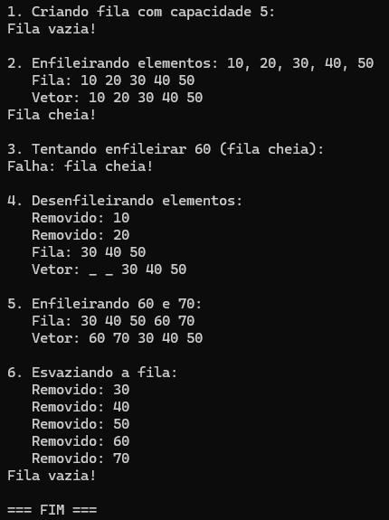

<h1 align="center">Fila Estática Circular</h1>

<p align="center">
  <strong>Implementação de uma Fila Estática Circular em C com vetor</strong><br>
  Estrutura de dados que segue o princípio FIFO (First In, First Out).
</p>

## Tópicos

- [Sobre o Projeto](#sobre-o-projeto) 
- [Conceito FIFO](#conceito-fifo) 
- [Fila Circular](#fila-circular) 
- [Estrutura do Projeto](#estrutura-do-projeto)  
- [Funcionalidades](#funcionalidades)  
- [Tecnologias](#tecnologias)  
- [Como executar o projeto](#como-executar-o-projeto)
- [Imagens do Projeto](#imagens-do-projeto)


# Sobre o Projeto
Este projeto implementa uma **Fila Estática Circular** em linguagem C, utilizando vetor com tamanho fixo definido pelo usuário. O objetivo é demonstrar os conceitos de estrutura de dados, comportamento FIFO (First In, First Out) e o aproveitamento circular de memória, otimizando o uso do espaço do vetor.

Os valores testados no programa são **pré-definidos no código** para demonstrar as funcionalidades da fila, incluindo enfileiramento, desenfileiramento, verificação de fila vazia/cheia e visualização da estrutura interna do vetor.

# Conceito FIFO

A fila é uma estrutura do tipo **FIFO (First In, First Out)** — "Primeiro a entrar, primeiro a sair". Isso significa que o primeiro elemento inserido na fila será o primeiro a ser removido. Imagine uma fila de supermercado: a primeira pessoa que chega é a primeira a ser atendida.

# Fila Circular

A **fila circular** é uma otimização da fila estática tradicional. Em uma fila estática comum, após algumas remoções, as posições iniciais do vetor ficam vazias e não podem ser reutilizadas, desperdiçando memória. A fila circular resolve esse problema utilizando os índices de forma circular, onde quando o final do vetor é atingido, a próxima inserção ocorre no início (se houver espaço).

**Funcionamento:**
- Os ponteiros `primeiro` e `ultimo` se movem circularmente pelo vetor
- Quando `ultimo` atinge o final do vetor, ele volta ao início
- O espaço liberado por remoções é reaproveitado para novas inserções


# Estrutura do Projeto

```
fila-estatica/
├── include/
│   └── fila.h          # Estrutura da fila e protótipos
├── src/
│   ├── main.c          # Programa principal com testes
│   └── fila.c          # Implementação da fila circular
├── readme-img/
│   └── resultado.png   # Imagem da execução
├── .gitignore
└── CMakeLists.txt      # Configuração do CMake para CLion

```

### `include/`

#### `fila.h`
- Define a estrutura `t_fila` com:
  - `v` - Vetor de inteiros (capacidade fixa)
  - `primeiro` - Índice do início da fila
  - `ultimo` - Índice do final da fila
  - `tamanho` - Quantidade atual de elementos
  - `capacidade` - Tamanho máximo da fila
- Protótipos das funções:
  - `constroi_fila` - Cria e inicializa a fila com capacidade definida
  - `estavazia` - Verifica se a fila está vazia
  - `esta_cheia` - Verifica se a fila está cheia
  - `enfileira` - Insere elemento no final da fila
  - `desenfileira` - Remove elemento do início da fila
  - `mostra_fila` - Exibe os elementos da fila (ordem FIFO)
  - `mostra_vetor` - Exibe todas as posições do vetor interno

### `src/`

#### `main.c`              
- Programa principal que demonstra o uso da fila circular
- **Valores pré-definidos:** Teste com capacidade 5 e inserções de 10, 20, 30, 40, 50
- Realiza operações de enfileiramento, desenfileiramento e demonstração do comportamento circular

#### `fila.c`       
- Implementação das funções de manipulação da fila circular


# Funcionalidades
- ✅ **Criação** da fila com capacidade definida pelo usuário
- ✅ **Enfileirar** - Inserção de elementos no final da fila
- ✅ **Desenfileirar** - Remoção de elementos do início da fila
- ✅ **Verificação** se a fila está vazia ou cheia
- ✅ **Exibição** dos elementos da fila (ordem FIFO)
- ✅ **Visualização** do vetor interno mostrando posições vazias
- ✅ **Aproveitamento circular** de memória
- ✅ Alocação dinâmica do vetor na criação


# Tecnologias
<table align="center">
      <tr>
        <th>
            Linguagem
        </th>
        <td>
            
        </td>
      </tr>
      <tr>
        <th>
            IDE
        </th>
        <td>
            
        </td>
      </tr>
      <tr>
        <th>
            Build System
        </th>
        <td>
            
        </td>
      </tr>
</table>


# Como executar o projeto

### Opção 1: CLion (Recomendado)

1. Clone este repositório:
```bash
git clone https://github.com/pedro-Trovo/fila-estatica
```

2. Abra o CLion e selecione **File → Open**

3. Escolha a pasta do projeto `fila-estatica`

4. O CLion irá automaticamente:
   - Detectar o arquivo `CMakeLists.txt`
   - Executar o CMake
   - Criar a configuração de build

5. Clique no botão **▶️ (Run)** no canto superior direito

6. O programa será executado e os resultados aparecerão no terminal integrado do CLion

### Opção 2: Terminal com GCC

1. Clone este repositório:
```bash
git clone https://github.com/pedro-Trovo/fila-estatica
```

2. Acesse a pasta do projeto:
```bash
cd fila-estatica
```

3. Compile o projeto com gcc:
```bash
gcc -o fila_estatica src/main.c src/fila.c -Iinclude
```

4. Execute o programa:
```bash
# Windows
fila_estatica.exe

# Linux/Mac
./fila_estatica
```

### Opção 3: Terminal com CMake

```bash
mkdir build && cd build
cmake ..
make
./fila_estatica
```


# Imagens do Projeto

<div align="center">
  
  <br>
  <em>Execução da fila circular no terminal</em>
</div>
